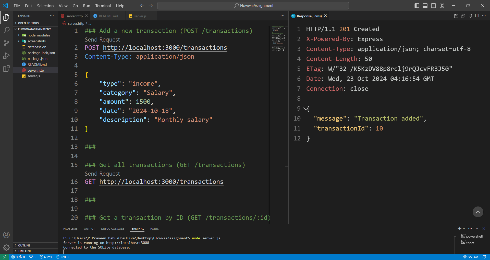
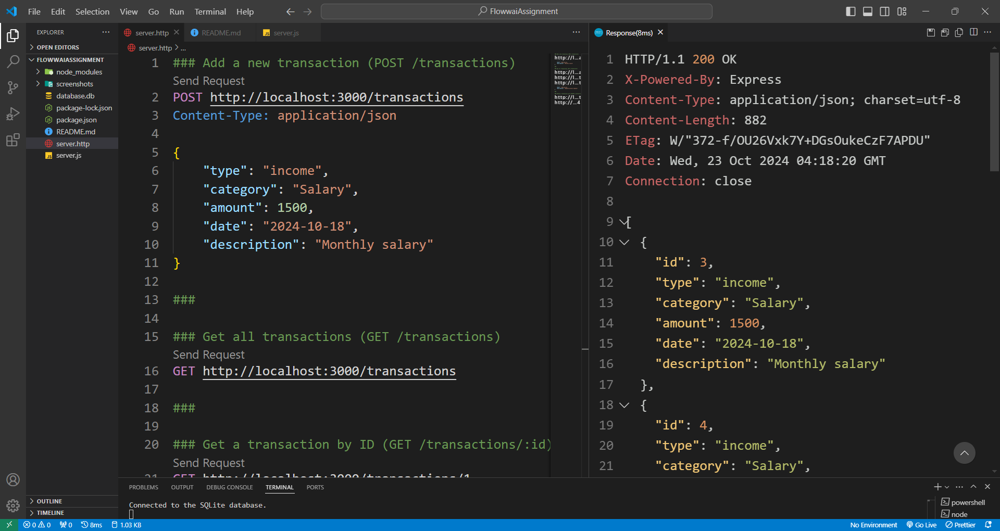
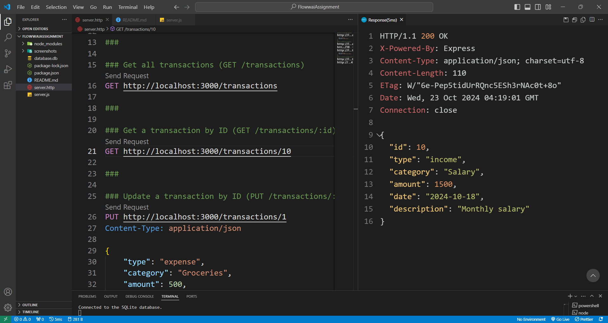
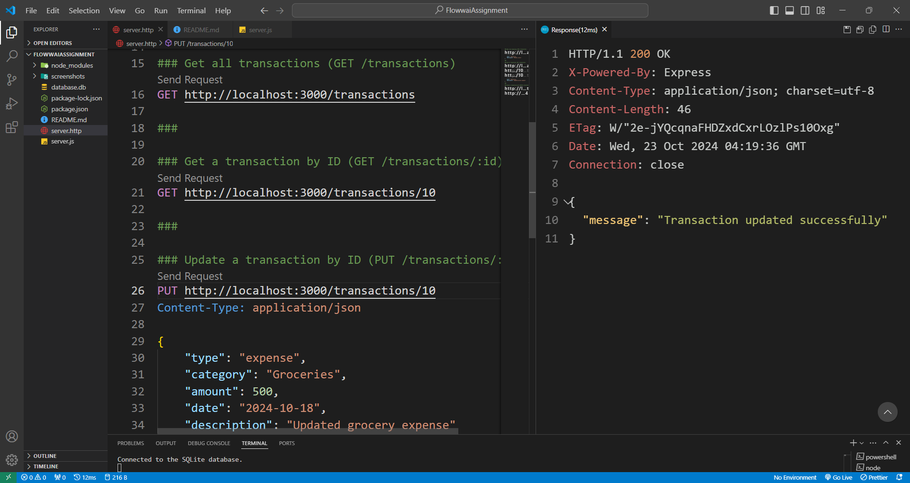
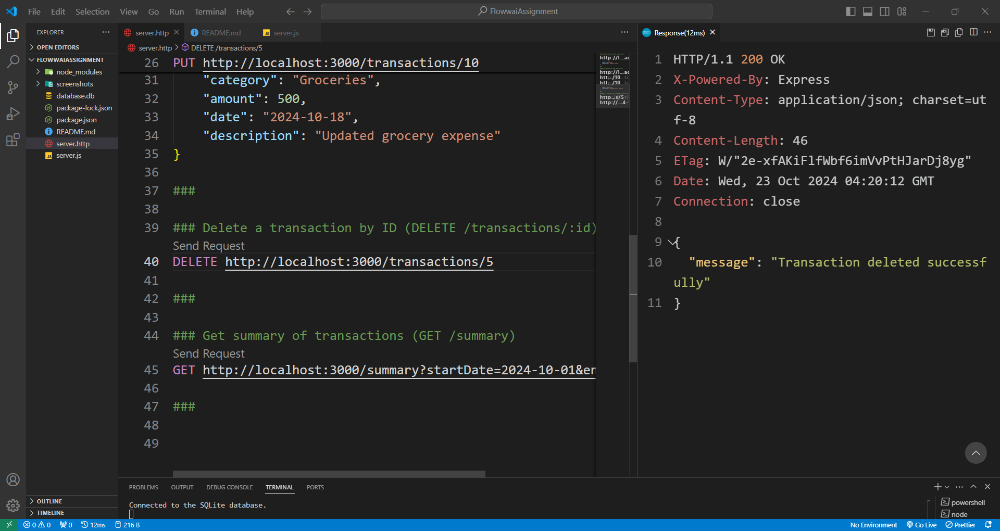
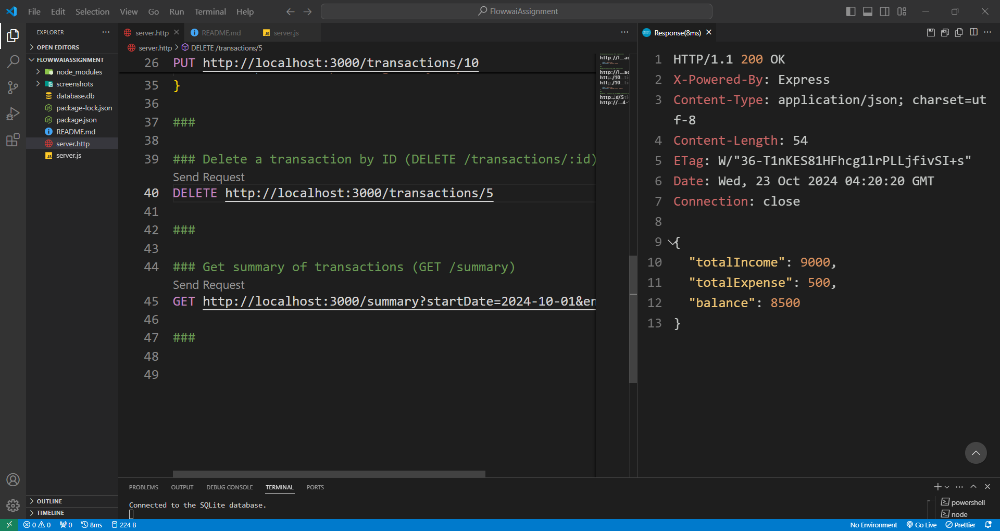

<<<<<<< HEAD
# Personal Financial Records API

This is a RESTful API for managing personal financial records. Users can record income and expenses, retrieve transactions, and get summaries by category or time period.

## 1. Setup Instructions

### Prerequisites
- Node.js (v14+)
- SQLite3 (Database setup handled by the app)
- .http file (or any other API client for testing)

### Installation
1. Clone the repository:
    ```bash
    git clone <your-repo-url>
    cd <your-project-directory>
    ```

2. Install dependencies:
    ```bash
    npm install
    ```

3. Start the server:
    ```bash
    node server.js
    ```

4. The API will be running at `http://localhost:3000`.

### Database
The SQLite database (`database.db`) is automatically created if it doesn't exist. Transactions are stored in the `transactions` table.

## 2. API Documentation

### POST `/transactions`
- **Description**: Adds a new transaction.
- **Request Body**:
    ```json
    {
        "type": "income",
        "category": "Salary",
        "amount": 1500,
        "date": "2024-10-18",
        "description": "Monthly salary"
    }
    ```
- **Response**:
    ```json
    {
        "message": "Transaction added",
        "transactionId": 1
    }
    ```

### GET `/transactions`
- **Description**: Retrieves all transactions.
- **Response**:
    ```json
    [
        {
            "id": 1,
            "type": "income",
            "category": "Salary",
            "amount": 1500,
            "date": "2024-10-18",
            "description": "Monthly salary"
        },
        ...
    ]
    ```

### GET `/transactions/:id`
- **Description**: Retrieves a specific transaction by ID.
- **Response**:
    ```json
    {
        "id": 1,
        "type": "income",
        "category": "Salary",
        "amount": 1500,
        "date": "2024-10-18",
        "description": "Monthly salary"
    }
    ```

### PUT `/transactions/:id`
- **Description**: Updates a specific transaction by ID.
- **Request Body**:
    ```json
    {
        "type": "expense",
        "category": "Groceries",
        "amount": 500,
        "date": "2024-10-19",
        "description": "Groceries for the week"
    }
    ```
- **Response**:
    ```json
    {
        "message": "Transaction updated successfully"
    }
    ```

### DELETE `/transactions/:id`
- **Description**: Deletes a specific transaction by ID.
- **Response**:
    ```json
    {
        "message": "Transaction deleted successfully"
    }
    ```

### GET `/summary`
- **Description**: Retrieves a summary of transactions including total income, total expenses, and balance.
- **Query Parameters**:
  - Optional filters: `startDate`, `endDate`, `category`
- **Response**:
    ```json
    {
        "totalIncome": 1500,
        "totalExpense": 500,
        "balance": 1000
    }
    ```

## 3. Response Screenshots

### Adding a Transaction


### Getting All Transactions


### Getting a Transaction by ID


### Updating a Transaction


### Deleting a Transaction


### Getting Summary

=======
# floww-ai-assignment-
>>>>>>> 08b652170353f74fe809b392cdba9aaa52e41134
